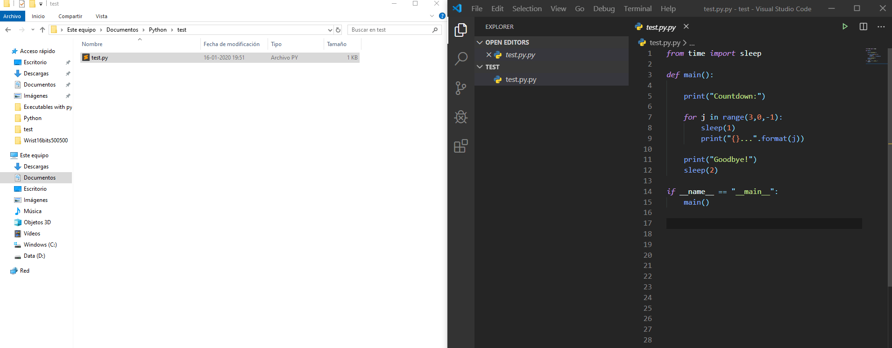
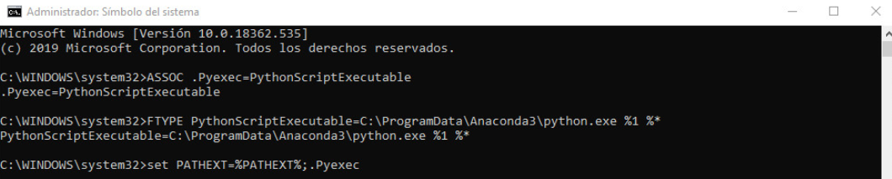

# Making-my-own-executable-python
Define your own .ExecutableExtension to run python code (and others) with just one click
___
# Run your python code in just one click
Sometimes you have scripts that you just need to reuse over and over again, so, it would be great if we just press a button and wait for the results, right?

## 1. The solution
Make executables files with Python.

The most famous (for me) library to do this is [pyinstaller](http://www.pyinstaller.org/), but I could not get it work, because of problems with some requirements that I could not fix. But a few years a ago, I tried to do the same for R script, and I found a very simple solution, that I will share with you.

<br />
<br />
<center>
<h3><i>Let's define our own executable extension from scratch using the CMD! </i>
</center>
<br />
<br />

## 1. Why is it useful? 
To run repetitive routines whith the same structured input data, like a `.csv` file (at least, that is my purpose to do this).

## 2. How to do that? 
Surprisingly, with just 3 lines of code in the CMD we can get what we want, but, before to show how to do this, let's take a look to an example, to see what we want to do at the end. 

But first, let's start defining a code example that we want to run with just one click. We will work with the `test.py` script.

>```python
>from time import sleep
>
>def main():
>    #___All my code inside this function___
>	print("Countdown:")
>
>	for j in range(3,0,-1):
>	    sleep(1)
>	    print("{}...".format(j))
>	    
>	print("Goodbye!")
>	sleep(2)
>   #___End to my code___
>
>if __name__ == "__main__":
>    main()
>```

This script will basicly show us the countdown from 3 to 0 and then say "Goodbye!".
    
We will define a new local extension for our computer, I will call it `.Pyexec`, and it will be set such that every file (with python code inside) can run in a specific `python.exe` (you can set an extension to an specific virtual enviroment). 


### The result? 


### Step 1:
Associate my own extension to a future path to an executable (both chosen by me)
>```
>   ASSOC .Pyexec=PythonScriptExecutable
>```


In this case 
- `.Pyexec` is my extension
- `PythonScriptExecutable` will be used to set a `python.exe` in step 2


### Step 2: 
>```
>   FTYPE .Pyexec=PythonScriptExecutable=path/to/my/python.exe %1 %*
>```

Two things: 
1. be ware to not forget ` %1 %*` at the end of the path.
2. Where is my python.exe? Well, with the `sys` library (you should have it installed by default) 
>```python
>   import sys
>   # Location of python installation
>    sys.prefix    
>```

In my case, it returns `"C:/ProgramData/Anaconda3/python.exe"` and I just need to change the `//` for `\` (because I am on windows):  `C:\ProgramData\Anaconda3\python.exe` and copy this to the CMD.

<center>
    <h6><b>REMARK</b> <i>if you are using another virtual enviroment (venv), it will print the python.exe's path inside your venv.</i></h6>
</center>
    
### Step 3
>```
>   set PATHEXT=%PATHEXT%;.Pyexec
>```

You need to write these trees steps in that order, in the CMD. Be careful to execute this with admin permission.



And that's all! 

Hope it helps :D 
